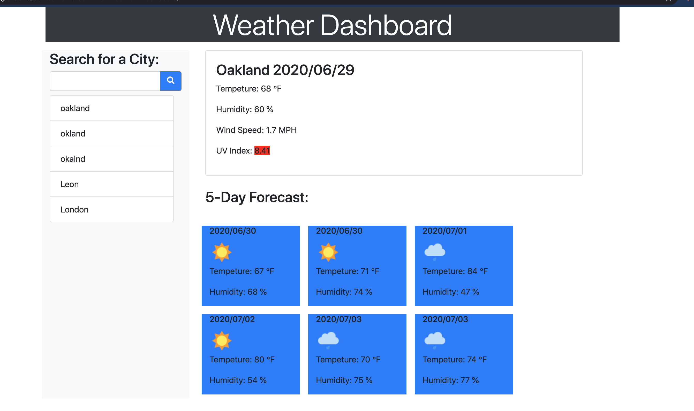

# 06-Server-Side-APIs-Weather-Dashboard
Weather Dashboard that retrieves data form another application's API.
 
## Getting Started
Please lode the belows link into your browser.

## Website view

## Built With

* [HTML](https://developer.mozilla.org/en-US/docs/Web/HTML)
* [CSS](https://developer.mozilla.org/en-US/docs/Web/CSS)
* [JS](https://developer.mozilla.org/en-US/docs/Web/JavaScript)

## Deployed Link

* https://adamjfreeman.github.io/weather-dashboard/index.html

## Contributing
* **ADAM FREEMAN** 

## Questions
 Adamjfreeman@gmail.com
 
